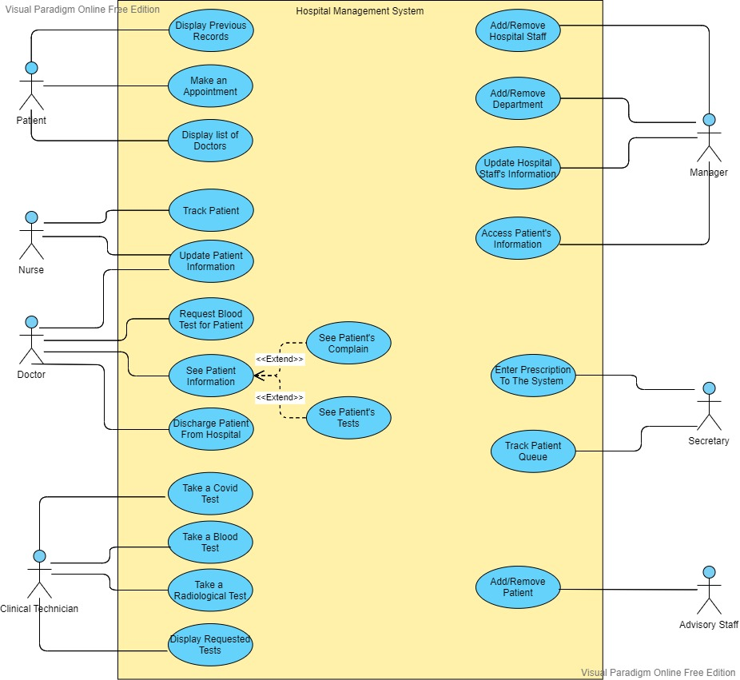
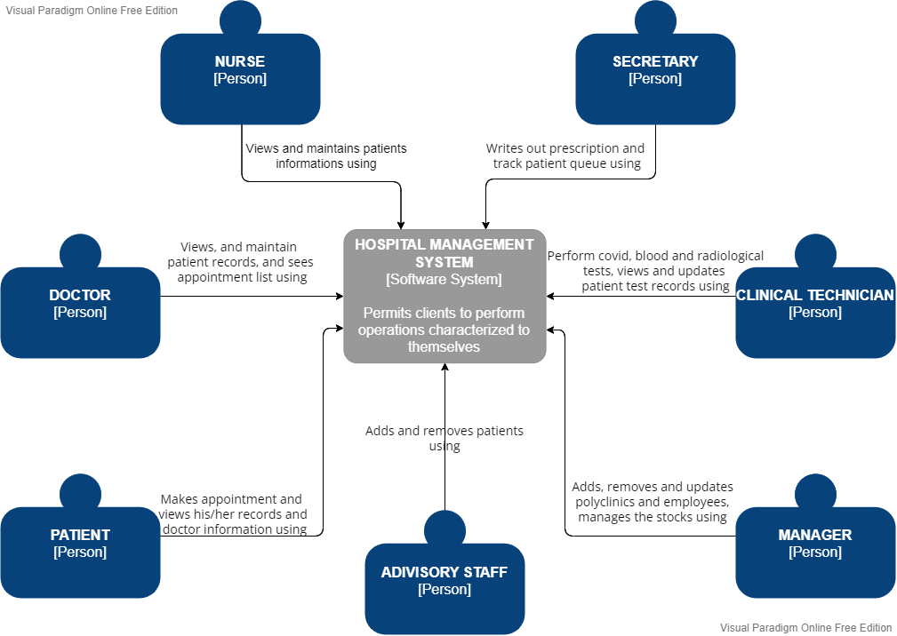
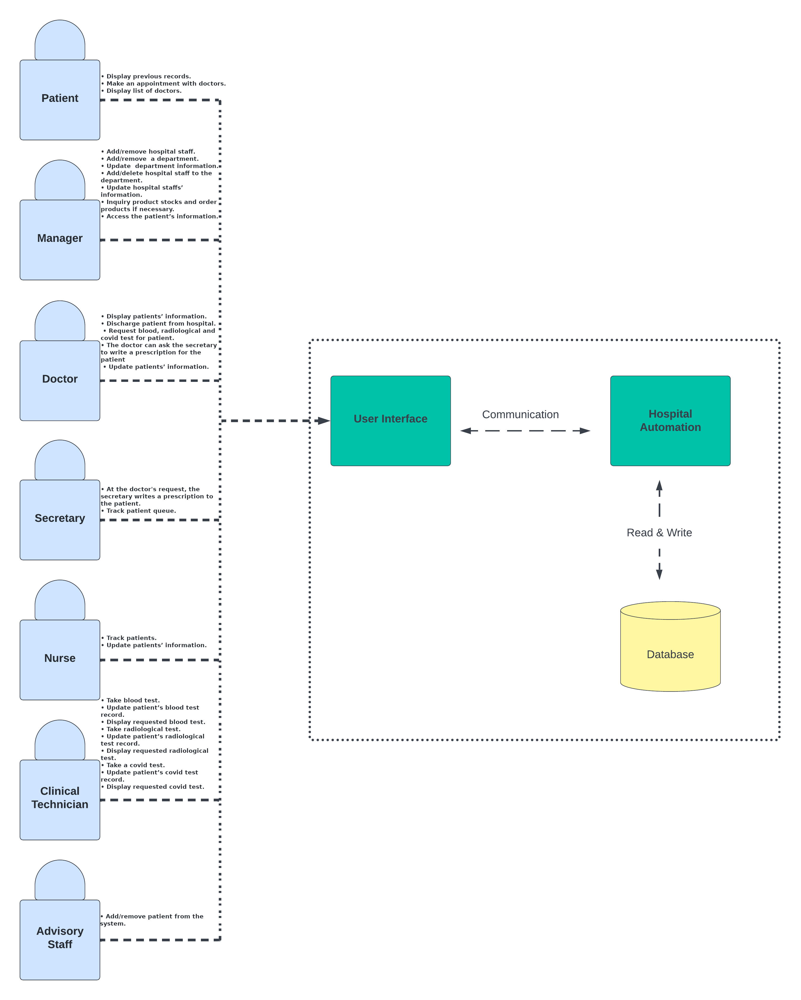

# CSE222-grup3 : Hospital management system
- [CSE222-grup3 : Hospital management system](#cse222-grup3--hospital-management-system)
  - [1. Problem Definition](#1-problem-definition)
  - [2. Users of the System](#2-users-of-the-system)
    - [2.1 Manager](#21-manager)
    - [2.2 Doctor](#22-doctor)
    - [2.3 Nurse](#23-nurse)
    - [2.4 Patient](#24-patient)
    - [2.5 Clinical Technician](#25-clinical-technician)
    - [2.6 Advisory Staff](#26-advisory-staff)
    - [2.7 Secretary](#27-secretary)
  - [4.  Requirements in Details](#4--requirements-in-details)
    - [4.1. Functional Requirements](#41-functional-requirements)
    - [4.2. Non-Functional Requirements](#42-non-functional-requirements)
  - [5. Use-Case Diagrams](#5-use-case-diagrams)
    - [5.1 Context Diagram](#51-context-diagram)
    - [5.2 Container Diagram](#52-container-diagram)
  - [Project Members](#project-members)

## 1. Problem Definition 
Since we live in a technological era, we can make our lives simpler by utilizing the resources available to us. The majority of tasks are automated. Keeping up with change and improvement in hospitals saves our both time and money. But the issue is that hospitals do not employ computerized software and operations are performed manually.Doctors, patients, and staff communicate slowly and ineffectively. Our goal is to overcome this issue by developing software that allows hospital employees, managers, and patients to communicate quickly and effectively.The system stores all data, and users may only access as much as they are authorized. In our system, there are seven different sorts of authorized users. For instance, a doctor, a clinic technician, a manager, a patient, a nurse, and so on. They all have varying levels of access. While the advising staff can only register the patient in the system, whereas the doctor has access to all of the patient's data. In summary, this hospital automation system would solve the communication and information problems while also saving our time and money.

## 2. Users of the System
The Hospital Management system has users such as manager, doctor, nurse, patient, clinical technician, advisory staff and secretary.
### 2.1 Manager 
- Add/remove hospital staff.
- Add/remove  a department.
- Update  department information.
- Add/delete hospital staff to the department.
- Update hospital staffs’ information.
- Inquiry product stocks and order products if necessary.
- Access the patient’s information.

### 2.2 Doctor 
- Display patients’ information.
- Discharge patient from hospital.
- Request blood, radiological and covid test for patient.
- The doctor can ask the secretary to write a prescription for the patient
- Update patients’ information.

### 2.3 Nurse 
- Track patients.
- Update patients’ information.

### 2.4 Patient 
- Display previous records.
- Make an appointment with doctors.
- Display list of doctors.

### 2.5 Clinical Technician 
- Take blood test.
- Update patient’s blood test record.
- Display requested blood test.
- Take radiological test.
- Update patient’s radiological test record.
- Display requested radiological test.
- Take a covid test.
- Update patient’s covid test record.
- Display requested covid test.

### 2.6 Advisory Staff
- Add/remove patient from the system.
### 2.7 Secretary 
- At the doctor's request, the secretary writes a prescription to the patient.
- Track patient queue.

## 4.  Requirements in Details 
### 4.1. Functional Requirements
- Manager shall be able to add/remove Doctor, Nurse, Patient, Clinical technician, Advisory staff and Secretary.
- Manager shall be able to update employee information.
- Manager and Doctor shall be able to view patient information.
- Doctor shall be able to discharge the patient and ask for analyses report.
- Secretary shall be able to prescribe and track patient queue.
- Nurse shall be able to patient follow up and update patient information.
- Patients shall be able to view the list of doctors, view own records and make an appointment.
- Clinical technician shall be able to update patient records, view patients waiting for analyses and do analyses.
- Advisory staff shall be able to add/remove patient.
### 4.2. Non-Functional Requirements
- Hardware should be able to run at least Java SE13.
- System can operate any hardware.
- Personnel having access to the system (especially administrators) should do the training course provided by our experienced staff.
- Reinstalling the system should be done by professionals in case of failure.
- Computer should be have minimum 200mb space for the software.
- System should be maintainable.

## 5. Use-Case Diagrams 

### 5.1 Context Diagram 

### 5.2 Container Diagram

## Project Members
1. Harun Eren ÖZKAYA
2. Süleyman Burak YAŞAR
3. Ahmet USLUOĞLU
4. Hasan Can ÖNDER
5. Muhammed Akif SEVİLGEN
6. Hümeyra Tuğçe YAVUZ
7. Murat KAYMAZ
8. Buse ELBİRGİÇ
9. Yusuf Talha ALTUN
